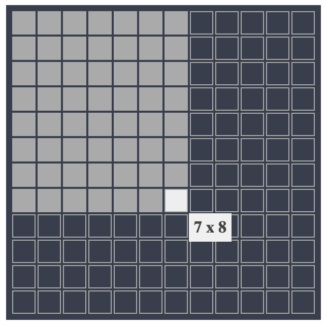

# react-hovertable [![NPM version][npm-image]][npm-url] [![Build Status][travis-image]][travis-url] [![Dependency Status][daviddm-image]][daviddm-url]

[](https://greenkeeper.io/)
> react hovertable to select column and row in a table!

## Installation

```sh
$ npm install --save react-hovertable
```

## Usage

```js
import React from 'react';
import ReactDOM from 'react-dom';
import HoverTable from '../src';

const onClick = (e, data) => {
  console.log('click', e, data);
};

const onMouseOver = (e, data) => {
  console.log('onMouseOver', e, data);
};

const onMouseOut = e => {
  console.log(e);
};

ReactDOM.render(
  <HoverTable
    column={12}
    row={12}
    width={300}
    height={300}
    onClick={onClick}
    showDimension={true} // show dimension or not
    onMouseOut={onMouseOut}
    onMouseOver={onMouseOver}
    />
, document.getElementById('root'));
```

for more usage, see [docs folder](./docs/index.js)

## Demo

[LIVE DEMO](https://canner.github.io/react-hovertable)



## Props

| **props**      | **type** | **required** | **default** | **description**                                                                                                                        |
|----------------|----------|--------------|-------------|----------------------------------------------------------------------------------------------------------------------------------------|
| width          | number   | true         | 350         | the width of hovertable                                                                                                                |
| height         | number   | true         | 350         | the height of hovertable                                                                                                               |
| row            | number   | true         | 12          | how many rows in hovertable                                                                                                            |
| column         | number   | true         | 12          | how many columns in hovertable                                                                                                         |
| selectedRow    | number   | false        | null        | selected row                                                                                                                           |
| selectedColumn | number   | false        | null        | selected column                                                                                                                        |
| onMouseOver    | function | false        | () => {}    | this will be trigger when mouse over, with two params, **e**: event object, **data**: {rowNumber, columnNumber, rollHeight, cellHeight} |
| onMouseOut     | function | false        | () => {}    | this will be trigger when mouse out                                                                                                    |
| onClick        | function | false        | () => {}    | this will be trigger when mouse over, with two params, **e**: event object, **data**: {rowNumber, columnNumber, rollHeight, cellHeight} |
| showDimension  | boolean  | false        | true        | show dimension div or not                                                                                                         |
| theme          | string   | false        | dark        | see styles folder in `src` for more theme options                                                |

## Example

clone the repository

```
node devServer.js
// open http://localhost:9393
```

## Maintainer

[chilijung](https://github.com/chilijung)

## License

MIT © [Canner](https://github.com/canner)


[npm-image]: https://badge.fury.io/js/react-hovertable.svg
[npm-url]: https://npmjs.org/package/react-hovertable
[travis-image]: https://travis-ci.org/Canner/react-hovertable.svg?branch=master
[travis-url]: https://travis-ci.org/Canner/react-hovertable
[daviddm-image]: https://david-dm.org/Canner/react-hovertable.svg?theme=shields.io
[daviddm-url]: https://david-dm.org/Canner/react-hovertable
